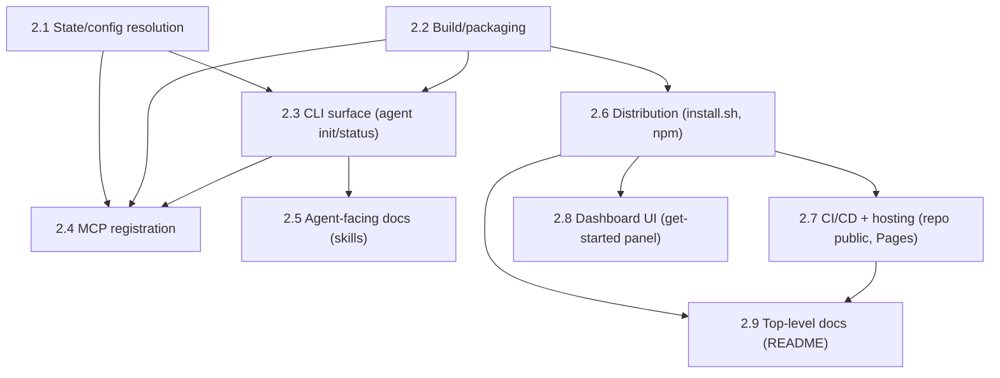

# Horizontal Plan — hdl-agent-onboarding

Breadth-first layer map. What each layer needs OVERALL to fulfill the
requirement — not execution order (that's vertical-plan.md).

## 1. Layer Inventory

1. **State/config resolution** — shared default DB path + config dir, the
   grill-caught foundational gap everything else depends on.
2. **Build/packaging** — compiled `dist/` output actually exercised, `bin`
   entrypoint shim, `npm pack` tarball correctness.
3. **CLI surface** — `heimdall agent init|status`, harness detection,
   registration/idempotency logic.
4. **MCP registration** — the actual `claude mcp add`/`codex mcp add`/
   `claude mcp get` shell-outs and their result parsing.
5. **Agent-facing docs (skills)** — 4 `SKILL.md` files installed to
   `~/.claude/skills/`.
6. **Distribution** — `scripts/install.sh`, npm package naming/publish prep.
7. **CI/CD + hosting** — repo visibility flip, GitHub Pages workflow, live
   publish verification.
8. **Dashboard UI** — the "get started" panel, its dismiss-state.
9. **Top-level docs** — README's new top line, dead-link fix.

## 2. Per-Layer Requirements

### 2.1 State/config resolution

Responsibility: give every Heimdall process (headless dev, desktop sidecar,
globally-installed CLI) a real, shared, persistent default when no `.env` is
present — the layer that makes every other layer's promise ("your agent sees
real fleet data") actually true.

Key files/seams: `src/core/routing/policy-loader.ts` (existing
`resolveDefaultPolicyPath` pattern to extend, not replace), `src/main.ts:130`,
`src/api/http-server.ts:882`, `src/api/mcp-server.ts:356`, **and
`src/api/cli.ts:57`** (four sites, not three — found in collaborative
review; all currently `new StateStore(env.HEIMDALL_DB_PATH ?? ":memory:")`
— this is the line that changes in each). New: a small XDG-style resolver
(no existing dependency for this; Node has nothing built in) covering both
DB path and config dir.

Must do overall: resolve a stable, creatable, per-machine default path;
create the parent directory if missing; verify SQLite WAL mode is safe for
the dashboard server + MCP process to share concurrently.

Dependencies: none upward — this is the foundation layer. Build/packaging,
CLI, and MCP registration all depend on it being correct before their own
work can be verified end-to-end.

### 2.2 Build/packaging

Responsibility: turn Heimdall from "a checkout you `tsx` into" into a real
publishable npm package.

Key files/seams: `package.json` (`engines.node` bump to `>=22.13.0`, drop
`--experimental-sqlite` from all scripts, add `"bin"`, add `"files"`/
`.npmignore`), `tsconfig.json` + the existing but unused `"build": "tsc"`
script (note: `rootDir: "."`/`outDir: "dist"` means output is
`dist/src/api/cli.js`, not a bare `dist/cli.js` — corrected in
collaborative review, the bin shim must target the real path), new
`bin/heimdall.js` (spawnSync shim over `dist/src/api/cli.js`).

Must do overall: produce a `dist/` that actually runs standalone (no `tsx`,
no dev-only deps required at runtime), a `bin` shim that's
platform-identical on macOS/Linux/Windows and points at the real compiled
path, and a real `npm pack --dry-run` tarball that contains everything
needed and nothing extraneous.

Dependencies: depends on 2.1 only insofar as the compiled CLI needs the new
resolver available at runtime. Independent of MCP registration, skills,
Pages, and dashboard — can be built and verified in isolation.

### 2.3 CLI surface

Responsibility: `heimdall agent init` / `heimdall agent status`, the
user-facing commands Portunus's `agent_setup.py` models.

Key files/seams: **`src/api/cli.ts` already exists and already dispatches**
(`npm run cli`, argv-routed `route`/`route-outcome`/default `lanes` —
corrected in collaborative review after the first draft wrongly assumed no
dispatcher existed). New `agent` branch added to its existing
if/else-if dispatch, backed by new `src/cli/agent-command.ts` for the actual
logic (mirroring how `route-command.ts` already backs the `route` branch).

Must do overall: `detectHarnesses()`, `registerMcp(harness)`,
`mcpRegistered(harness)` (targeted `claude mcp get`, `codex mcp list`
fallback), `installSkills()` (content-diffed, idempotent), `--harness`
(repeatable) and `--json` flags on both subcommands.

Dependencies: needs 2.2's `bin`/dispatch shape to exist first (nothing to
attach a subcommand to otherwise). Its `registerMcp` step produces the
invocation string (`heimdall mcp`) that 2.1's resolver has to make correct
by the time an agent actually calls it.

### 2.4 MCP registration

Responsibility: the actual shell-outs to `claude mcp add`/`codex mcp add`
and result parsing — this is a sub-concern of 2.3 but distinct enough to
verify on its own (real command syntax already confirmed in Phase A
research, not guessed).

Key files/seams: `child_process` calls inside `agent-command.ts`, using the
confirmed real syntax: `claude mcp add --scope user heimdall -- heimdall
mcp`, `codex mcp add heimdall -- heimdall mcp`, `claude mcp get heimdall`.

Must do overall: handle "already registered" idempotently (don't error, don't
duplicate), handle "harness not installed" gracefully (skip, report in
status), surface real stderr on failure rather than swallowing it.

Dependencies: depends on 2.2 (the `heimdall` bin must resolve on PATH before
`claude mcp add ... -- heimdall mcp` means anything) and 2.1 (registering a
command that returns fake in-memory data is worse than not registering it).

### 2.5 Agent-facing docs (skills)

Responsibility: 4 `SKILL.md` files that make the 10 real MCP tools usable
without reading source — the actual point of the epic, not a checkbox.

Key files/seams: new `agent_skills/{name}/SKILL.md` (mirrors Portunus's own
source layout, copied by `installSkills()` at init time) — `heimdall-lanes`,
`heimdall-routing` (with the explicit `route_selection` naming note per
design-discussion §3 item 3), `heimdall-models`, `heimdall-status`. Real
parameter names/types from the Phase A research's tool inventory, not
placeholders.

Must do overall: each skill documents real tool names, real required/
optional params, and at least one real example call per tool.

Dependencies: content-independent of every other layer (can be written in
parallel with 2.1-2.4), but the *install mechanism* (`installSkills()`)
lives inside 2.3.

### 2.6 Distribution

Responsibility: `scripts/install.sh` and npm publish readiness.

Key files/seams: new `scripts/install.sh` (`npm install -g pantheon-heimdall`
then `heimdall agent init`), `package.json`'s `"name": "pantheon-heimdall"`
(confirmed available on npm).

Must do overall: a real, tested (not just written) install script; a
tarball verified via `npm pack --dry-run` inspection. The actual `npm
publish` is explicitly NOT assumed in scope (design-discussion open
question 1) — this layer prepares publish-readiness and flags the actual
publish action back to the operator rather than running it unattended.

Dependencies: depends on 2.2 (nothing to install without a working package)
and 2.7 (install.sh's hosting location is the GH Pages layer).

### 2.7 CI/CD + hosting

Responsibility: make `mdostal/heimdall` public, stand up GitHub Pages
**branch-based** (not Actions-based — GitHub Actions is account-wide
billing-blocked for this repo right now, per
`docs/decisions/DEC-hdl-local-build-verification.md`; corrected in
collaborative review after the first draft planned an Actions workflow that
cannot run at all under this block), publish both the existing (already
dead) Jekyll docs site and `install.sh` to the Pages root.

Key files/seams: a pushed `gh-pages` branch (plain `git push`, no Actions
involved) containing the built docs site + `install.sh`; `gh api
repos/mdostal/heimdall/pages -X POST -f source[branch]=gh-pages -f
source[path]=/` to enable Pages (`build_type: legacy`); repo visibility
setting (operator-approved, done via `gh repo edit --visibility public` or
the GitHub UI — a real, distinct, reviewable action, not folded silently
into a code commit).

Must do overall: repo goes public; `gh-pages` branch content is pushed and
Pages enabled against it; the deployed site is live-curled and verified,
not just "push succeeded" — first deploys can lag a few minutes. No
GitHub-hosted Actions runner is involved anywhere in this layer.

Dependencies: the repo-visibility flip has no code dependency but is a
prerequisite for verifying anything else in this layer. `install.sh`'s
*content* depends on 2.6.

### 2.8 Dashboard UI

Responsibility: the "get started" panel — prominent on first visit,
dismissible, state persisted server-side.

Key files/seams: `src/api/ui/dashboard.ts` (new first panel, above Fleet
Scope), `src/api/http-server.ts` (new `AGENT_ONBOARDING_DISMISSED_KEY` +
`getActive*`/`set*` pair + `GET`/`POST /agent-onboarding-dismissed`,
mirroring `THEME_SETTING_KEY`/`ICON_SETTING_KEY` exactly).

Must do overall: real copy (curl one-liner + `heimdall agent init` + a link
to skill docs), dismiss button that persists via the existing settings-table
pattern, renders identically whether loaded via plain browser or the desktop
app's webview.

Dependencies: content references 2.6's install.sh URL and 2.3's actual
command names — should land after those are finalized, even though the
panel's own code (route + markup) has no hard technical dependency.

### 2.9 Top-level docs

Responsibility: README's new top-line curl command, fixing the pre-existing
dead docs-site link as a side effect of 2.7 going live.

Key files/seams: `README.md` (new line under the existing badges, ahead of
"What & why"), no change needed to `docs/_config.yml` itself (Pages just
needs to actually be enabled per 2.7).

Dependencies: depends on 2.6 (the actual curl URL) and 2.7 (Pages being live
enough that the doc-site link stops being a lie).

## 3. Cross-Layer Dependencies

- **2.1 (state/config) gates 2.3 and 2.4** — registering an agent's MCP
  connection before the shared-DB-path fix lands means shipping the exact
  bug grill caught. This is the epic's real critical path.
- **2.2 (build/packaging) gates 2.3, 2.4, 2.6** — nothing to register,
  detect, or install without a working `bin` entrypoint first.
- **2.7's repo-visibility flip gates 2.7's own Pages verification and 2.9**
  — but does NOT gate 2.1-2.6, which can all be built and unit-verified
  against a private repo just fine.
- **2.5 (skills) is the most independent layer** — its content can be
  written in parallel with everything else; only its *installation
  mechanism* is coupled to 2.3.
- **2.8 (dashboard) is content-coupled but not technically coupled** to 2.3
  and 2.6 — the panel's markup/route can be built early, but shipping it
  with placeholder copy before the real command/URL exists would ship a
  broken "get started" experience, defeating the point.

## 4. Layer Map Diagram

## 5. Scope Summary

Nine layers, none individually large — the weight is in sequencing and in
2.1, the layer this draft didn't originally know it needed (grill caught it;
it's now the epic's true foundation, not an afterthought). 2.2 (packaging)
and 2.3/2.4 (CLI + MCP registration) carry the most unfamiliar-territory risk
(this repo has never been packaged or published before). 2.5 (skills) and
2.9 (README) are the lowest-risk, most parallelizable layers. 2.7 carries
the one genuinely irreversible-in-spirit action (repo visibility), already
operator-approved and worth isolating into its own reviewable step rather
than bundling into a larger commit.
