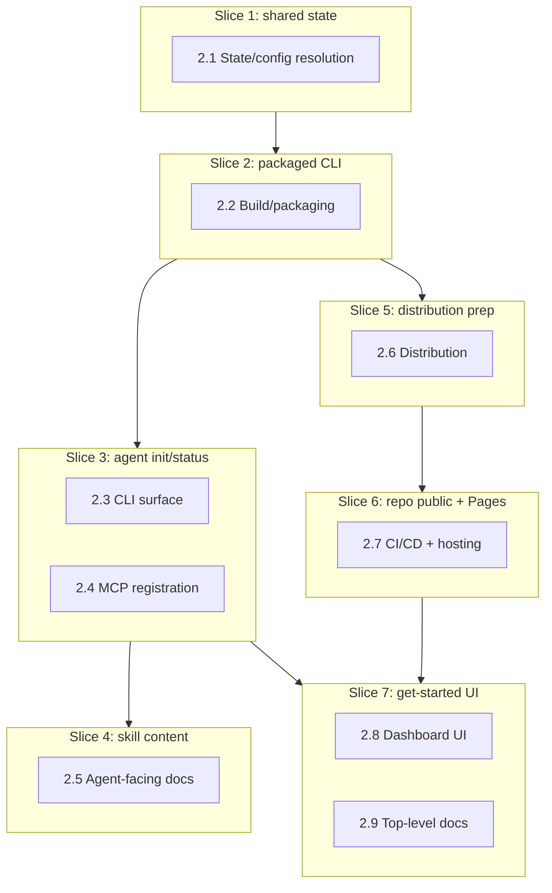

# Vertical Plan — hdl-agent-onboarding

Cuts the horizontal layer map into minimum cross-stack increments, each a
working, demo-able, commit-worthy state.

## 1. Slicing Strategy

The horizontal map's dependency chain is mostly linear (2.1 → 2.2 → 2.3/2.4
→ 2.6 → 2.7 → 2.8/2.9), with 2.5 (skills content) parallelizable alongside
2.3. Slices follow that chain directly rather than cutting across it,
because each layer's own risk (packaging has never been done in this repo;
the shared-DB fix is genuinely novel) needs to be retired before the next
layer can be verified for real rather than mocked. Slice 1 proves the
grill-caught foundational gap is actually fixed — that's the thinnest
real end-to-end increment that matters, not a trivial "hello world" slice.
Repo-visibility (the one irreversible-in-spirit action) gets its own
isolated slice (6) so it's reviewable independent of any code change.

## 2. Vertical Slice Plan

### Slice 1 — Shared, persistent state by default

**Goal / what works after:** `npm run dev` (or `dev:http-only`), `npm run
mcp`, and `npm run cli`, run as separate local processes with no `.env`
present, share one real on-disk SQLite database instead of each getting its
own `:memory:` (four call sites fixed — `main.ts`, `http-server.ts`,
`mcp-server.ts`, and `cli.ts`, the last one found in collaborative review).
A lane override made through one process is visible to the others.

**Layers touched:** 2.1 (state/config resolution) entirely.

**NOT yet included:** no packaging, no CLI, no agent registration — this is
pure backend correctness.

**Verified by:** live test — start both processes, `POST` a lane override
via the HTTP server, call `heimdall.lanes.list` via the MCP stdio server
(scripted client, not yet the real CLI), confirm the override shows up.
Plus a real concurrent-write check for `SQLITE_BUSY` under WAL mode.

**Commit represents:** the fix for the single highest-severity finding from
this epic's own adversarial review (grill-record H1) — the point where
"register an agent" stops being able to silently mean "register it against
fake empty data."

**Dependencies:** none (foundation slice).

### Slice 2 — A real packaged CLI exists

**Goal / what works after:** `node bin/heimdall.js mcp` starts the compiled
MCP server with no `tsx`, no dev dependency, using Slice 1's shared default
DB path. `npm pack --dry-run` produces a tarball with everything needed.

**Layers touched:** 2.2 (build/packaging).

**NOT yet included:** no `agent` command inside the dispatcher yet — `bin/
heimdall.js` targets the real compiled path (`dist/src/api/cli.js`, not a
bare `dist/cli.js` — corrected in collaborative review) and exercises
`cli.ts`'s existing `route`/`route-outcome`/`lanes` dispatch, which already
exists and is not being reinvented.

**Verified by:** real `npm pack --dry-run` + tarball content inspection;
run the compiled shim directly and confirm it behaves identically to
`npm run cli`/`npm run mcp` today (same dispatch, same stdio MCP handshake).

**Commit represents:** the point where Heimdall stops being "a checkout you
`tsx` into" and becomes an actual package, for the first time in this
repo's history.

**Dependencies:** Slice 1 (the compiled CLI needs the fixed default-path
resolver, not the old `:memory:` default).

### Slice 3 — `heimdall agent init`/`status` register a real harness

**Goal / what works after:** `heimdall agent init` (built on Slice 2's
`bin`) detects Claude Code/Codex on this machine, runs the real `claude mcp
add --scope user heimdall -- heimdall mcp` / `codex mcp add heimdall --
heimdall mcp`, and `heimdall agent status` confirms registration via
`claude mcp get heimdall` / `codex mcp list` without re-registering.

**Layers touched:** 2.3 (CLI surface) + 2.4 (MCP registration).

**NOT yet included:** skill installation (Slice 4), install.sh (Slice 5).

**Verified by:** live run against this machine's real `claude`/`codex`
binaries — register for real, confirm via `claude mcp get heimdall`, run
`heimdall agent status` and confirm it reports correctly without mutating
anything, run `heimdall agent init` a second time and confirm idempotency
(no duplicate registration, no error).

**Commit represents:** the actual "plug your agent in" moment — after this
slice, a real Claude Code session in this environment can call Heimdall's
MCP tools and get back Slice 1's real shared state.

**Dependencies:** Slice 2 (needs the `bin` entrypoint to register a command
that resolves).

### Slice 4 — Real, useful skill content installed

**Goal / what works after:** `heimdall agent init` also installs 4 real
`SKILL.md` files (`heimdall-lanes`, `heimdall-routing`, `heimdall-models`,
`heimdall-status`) into `~/.claude/skills/`, content-diffed so re-running
init doesn't clobber untouched files. Each skill documents real tool names/
params/example calls from the Phase A research's tool inventory.

**Layers touched:** 2.5 (skills content) + the install-mechanism slice of
2.3.

**NOT yet included:** distribution/install.sh.

**Verified by:** run `heimdall agent init` on this machine, confirm all 4
files land with real content (not stubs), edit one locally and re-run init,
confirm the edited file is left alone only if content differs from source
(i.e. confirm the diff-before-overwrite logic actually works, not just that
files exist).

**Commit represents:** the actual point of the epic — an agent that reads
these skills can use Heimdall correctly without reading source.

**Dependencies:** Slice 3 (the `installSkills()` call site lives inside
`agent init`).

### Slice 5 — Distribution readiness (not yet live)

**Goal / what works after:** `scripts/install.sh` exists with real content
(`npm install -g pantheon-heimdall && heimdall agent init`), package name
`pantheon-heimdall` is set in `package.json`, `npm pack --dry-run` from
Slice 2 is re-verified against the final package shape.

**Layers touched:** 2.6 (distribution).

**NOT yet included:** the actual `npm publish` (flagged back to the operator
per design-discussion open question 1, not run here) and GitHub Pages
hosting (Slice 6) — `install.sh` is written and locally sanity-checked
(shellcheck + a local dry run against a `npm pack` tarball) but not yet
reachable via a real curl URL.

**Verified by:** `shellcheck scripts/install.sh`; a local simulation —
`npm pack`, install the resulting tarball globally in a scratch environment,
confirm `heimdall` resolves on PATH and `heimdall agent init` runs.

**Commit represents:** distribution is *ready*; going live is a distinct,
separately-reviewable action (Slice 6).

**Dependencies:** Slice 2 (needs the final package shape).

### Slice 6 — Repo goes public, GitHub Pages goes live

**Goal / what works after:** `mdostal/heimdall` is public (operator-approved
action, done as its own isolated step). A `gh-pages` branch, pushed directly
(**not** via a GitHub Actions workflow — Actions is account-wide
billing-blocked for this repo per `docs/decisions/
DEC-hdl-local-build-verification.md`, corrected in collaborative review
from the first draft's Actions-workflow plan, which could never have run),
carries the Jekyll docs site + `install.sh`; Pages enabled against it via
`gh api repos/mdostal/heimdall/pages -X POST -f source[branch]=gh-pages -f
source[path]=/`. Both the pre-existing dead docs-site link and the new
install.sh URL are live-curled and confirmed working at
`https://mdostal.github.io/heimdall/`.

**Layers touched:** 2.7 (CI/CD + hosting) entirely.

**NOT yet included:** dashboard/README references to the live URL (Slice 7)
— this slice makes the URL real; the next slice points people at it.

**Verified by:** real `curl -I https://mdostal.github.io/heimdall/` and
`curl -fsSL https://mdostal.github.io/heimdall/install.sh` after enabling
Pages, retried across a few minutes for Pages' first-deploy propagation lag,
not declared broken on the first failed attempt.

**Commit represents:** the single most consequential action in this epic
(repo visibility flip) landing on its own, reviewable independent of any
other change.

**Dependencies:** Slice 5 (install.sh's real content must exist before
publishing it) — no code dependency on Slices 1-4, could in principle run
in parallel with them, but sequenced last among the "backend" slices so the
irreversible action isn't taken before everything it's meant to expose
actually works.

### Slice 7 — The get-started experience, end to end

**Goal / what works after:** Dashboard shows a new first panel (above Fleet
Scope) with the real, now-live curl command, `heimdall agent init`
instructions, and a link to the skill docs. Dismissible, state persisted
server-side via a new settings-table key (mirrors theme/icon exactly).
README's top line is the curl one-liner. This is the full, real, live
"someone lands here for the first time" experience the operator asked for.

**Layers touched:** 2.8 (dashboard UI) + 2.9 (top-level docs).

**NOT yet included:** nothing — this is the last slice.

**Verified by:** real Playwright load of the dashboard, confirm the panel
renders with the real (not placeholder) curl URL from Slice 6, click
dismiss, reload, confirm it stays dismissed; confirm it also renders
correctly inside the desktop app's webview (same HTTP server, different
client).

**Commit represents:** epic complete — the operator's original ask
("top and forward... collapse after the first time") fully realized with
every referenced command/URL actually live, not placeholder text.

**Dependencies:** Slice 3 (real command names), Slice 6 (real live URL).

## 3. Overlay Diagram

## 4. Deferred Items

- **Real `npm publish`** — explicitly out of this slice plan. Slice 5 leaves
  the package publish-ready and dry-run-verified; the actual publish is
  flagged back to the operator as a distinct action (same posture as
  Slice 6's repo-visibility flip, but the operator hasn't yet been asked
  about this one specifically — surface it before/during Slice 5 execution).
- **Cross-platform (Windows/Linux) CLI verification** — no such machine
  available this session. The `bin` shim's design avoids the known Windows
  shebang-parsing break by construction (design-discussion §3 item 1), but
  it is not actually run on Windows here. Documented as a known gap, not
  silently skipped.
- **`route_selection` tool renaming** — explicitly deferred out of this epic
  per design-discussion §3 item 3 (H3 resolution); documented under its
  real name with an inline note instead.
- **Pantheon-plugin-mode agent wiring** — out of scope per design-discussion
  §1's scope statement; that's Vesta/Multica's mechanism, not this epic's.

## 5. Risk by Slice

- **Slice 1 — medium.** Novel territory (multi-process SQLite access) for
  this repo; the dominant risk is WAL-mode concurrency not behaving as
  expected under real (not mocked) concurrent access.
- **Slice 2 — medium.** First-ever `npm pack`/packaging in this repo's
  history; dominant risk is a missing file in the published tarball that
  only surfaces on a real install, not in local dev.
- **Slice 3 — low-medium.** Portunus's pattern is proven and the real
  command syntax is already confirmed (Phase A research); dominant risk is
  edge cases in idempotency (double-init, harness half-installed).
- **Slice 4 — low.** Content work; dominant risk is shallow/stub-quality
  skill content rather than technical failure.
- **Slice 5 — low.** Mostly a rehearsal of Slice 2's packaging; dominant
  risk is install.sh assuming a shell/environment this session can't fully
  verify (e.g. non-bash shells).
- **Slice 6 — high.** The one irreversible-in-spirit action in the epic
  (repo visibility) plus GitHub's own propagation-delay uncertainty;
  dominant risk is treating "push succeeded"/"Pages API accepted" as
  equivalent to "actually live" without the retry-verified curl.
- **Slice 7 — low.** Pure UI/content work built on already-verified real
  data from every prior slice; dominant risk is copy quality, not
  correctness.

## 6. Moldability Notes

- **Slices 3 and 4 could merge** into one commit if the skill content is
  ready at the same time as the CLI surface — they're split here mainly so
  skill-writing (parallelizable, content-only work) doesn't block on CLI
  correctness being fully nailed down first, not because they're
  operationally required to ship separately.
- **Slice 5 and Slice 6 could reorder** — distribution prep doesn't strictly
  need to precede the repo-visibility flip; they're sequenced this way so
  the irreversible action isn't taken until there's something real to
  expose through it, not because of a hard technical dependency.
- **Slice 1 cannot move** — every other slice's "verified by" step either
  directly or indirectly assumes Slice 1's shared-state fix is in place;
  moving it later would mean re-verifying every subsequent slice against a
  known-wrong assumption.
- **Slice 7 splits cleanly** into "dashboard panel" and "README line" if a
  narrower final increment is wanted — they touch unrelated files and have
  no dependency on each other beyond both wanting the same real URL/command
  text from Slices 3 and 6.
