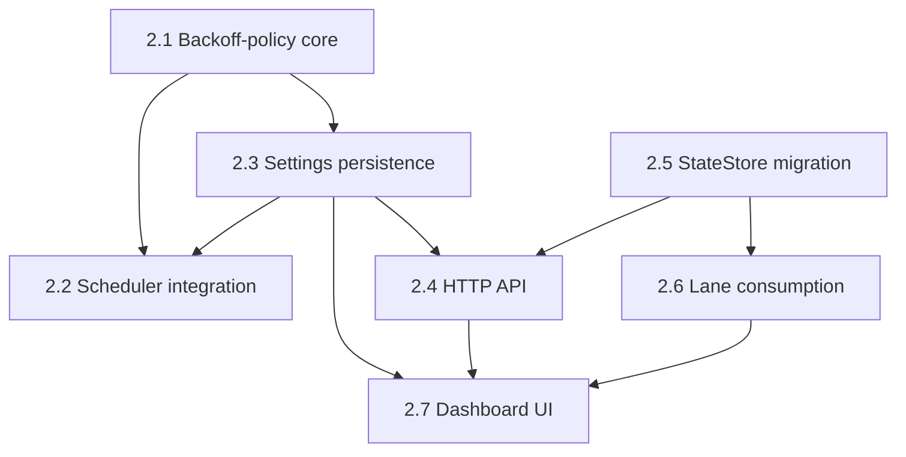

# Horizontal Plan — hdl-backoff-policies

Breadth-first layer map. What each layer needs OVERALL to fulfill the
requirement — not execution order (that's vertical-plan.md).

## 1. Layer Inventory

1. **Backoff-policy core** — the `BackoffPolicy` interface, registry, and 3
   policy implementations (static/progressive/exponential-progressive).
2. **Scheduler integration** — `InProcessScheduler`'s new
   `consecutiveSuspectTicks` state and the restructured `computeDelayMs`
   (pre-policy invariants: auth_failed, resetAt; then delegate to policy).
3. **Settings persistence** — backoff-policy settings-table keys (global
   choice, per-provider overrides, policy parameters), following the
   `routing_strategy` pattern exactly.
4. **HTTP API** — `GET`/`POST /backoff-policy` routes; new headroom/
   cost-tier live-edit routes on the existing lanes surface.
5. **StateStore migration** — `manual_headroom`/`manual_cost_tier` columns
   on `lanes`, defensive `ALTER TABLE ADD COLUMN`, get/set pairs.
6. **Lane consumption** — `lane-registry.ts`/`scored-strategy.ts` resolve
   the manual-value-wins-over-env-default precedence for headroom/cost-tier.
7. **Dashboard UI** — new "Probe backoff" Settings section (policy picker
   + per-provider override + advanced parameters), per-lane headroom/
   cost-tier editable fields in the existing lane rows.

## 2. Per-Layer Requirements

### 2.1 Backoff-policy core

Responsibility: the pluggable heuristic itself — pure functions, no I/O,
no scheduler coupling.

Key files/seams: new `src/core/scheduler/backoff-policies/{types,
static-backoff, progressive-backoff, exponential-progressive-backoff,
registry}.ts`, directly mirroring `src/core/routing-strategies/{types,
priority-strategy, round-robin-strategy, off-strategy, registry}.ts`'s
real, existing file layout and export shape.

Must do overall: `BackoffPolicy` interface with `nextDelayMs(ctx:
{consecutiveSuspectTicks, baseIntervalMs, config}): number` (no
`errorCode`/`resetAt` — those are pre-policy invariants per design-
discussion §3 item 4, post-grill). Three implementations with the worked
wall-clock numbers from design-discussion §3 item 2. Registry factory
`createBackoffPolicyRegistry(): Record<string, BackoffPolicy>`.

Dependencies: none upward — this is a pure, self-contained layer, fully
unit-testable in isolation exactly like the routing-strategies precedent.

### 2.2 Scheduler integration

Responsibility: wire the pluggable policy into `InProcessScheduler`
without disturbing its existing safety-critical behavior.

Key files/seams: `src/core/scheduler/in-process-scheduler.ts`
(`computeDelayMs`, `poll()`, lines 83-183, read in full during research).

Must do overall: restructure `computeDelayMs` to check `auth_failed` then
`resetAt` (both unchanged from today) before delegating to the selected
`BackoffPolicy`; add `consecutiveSuspectTicks` instance state, incremented
in `poll()` while `stillSuspect`, reset to 0 the instant it isn't — right
next to the existing `stillSuspect` computation so the reset-on-recovery
guarantee stays visible where it's already documented.

Dependencies: depends on 2.1 (the policy interface/registry must exist)
and 2.3 (needs to read the active policy name + resolved parameters from
settings to know which policy/config to invoke).

### 2.3 Settings persistence

Responsibility: global policy choice, per-provider overrides, and
policy-specific parameters — all settings-table rows, all scalars (per
design-discussion §3 item 6, post-grill correction).

Key files/seams: the real pattern has split ownership (corrected post-
collaborative-review): `ROUTING_STRATEGY_SETTING_KEY` and
`getActiveRoutingStrategyName` live in `src/core/route-selector.ts` (the
core file that actually consumes the active strategy), while
`setRoutingStrategy` and the HTTP handlers live in `src/api/
http-server.ts`. Mirror this split exactly: `BACKOFF_POLICY_SETTING_KEY`
and `getActiveBackoffPolicyName` belong in
`src/core/scheduler/backoff-policies/registry.ts` (the core file
`InProcessScheduler` imports from), `setBackoffPolicy` and the HTTP
handlers belong in `http-server.ts`.

Must do overall: `BACKOFF_POLICY_SETTING_KEY` (default `"static"`), one
`backoff_policy_override_<provider>` key per known provider (6 providers,
optional, falls through to global), one settings key per policy parameter
(`backoff_progressive_level_cap`, `backoff_exponential_multiplier`,
`backoff_exponential_ceiling_ms`) with sane defaults matching design-
discussion §3 item 2's worked example.

Dependencies: depends on 2.1 (needs to know what parameters each policy
actually takes). Gates 2.2 (scheduler reads resolved settings) and 2.4
(HTTP routes expose them).

### 2.4 HTTP API

Responsibility: `GET`/`POST /backoff-policy` (mirroring `/routing-
strategy` exactly — `{active, available}` on GET, structured `{error,
...}` on invalid POST), plus new headroom/cost-tier live-edit routes on
the lanes surface with real input validation (design-discussion §3 item 7,
post-grill correction — reject invalid input with a 400, never silently
drop the lane).

Key files/seams: `src/api/http-server.ts` (existing `/routing-strategy`
routes as the direct pattern; existing `/lanes/:laneId/override` as the
per-lane-mutation pattern to extend).

Dependencies: depends on 2.3 (settings must exist to read/write) and 2.5
(headroom/cost-tier routes need the new StateStore columns).

### 2.5 StateStore migration

Responsibility: `manual_headroom`/`manual_cost_tier` per-lane columns,
same defensive-migration and get/set-pair shape as `manual_override`/
`manual_reset_at`.

Key files/seams: `src/core/state-store.ts` (`manual_override`/
`manual_reset_at` columns and their `ALTER TABLE ADD COLUMN` migrations,
lines 45-46, 151-173, 314-366, read in full during research — the exact
pattern to copy).

Must do overall: `ALTER TABLE lanes ADD COLUMN manual_headroom REAL` /
`ADD COLUMN manual_cost_tier TEXT CHECK (manual_cost_tier IN
('low','medium','high') OR manual_cost_tier IS NULL)`, wrapped in the same
idempotent try/catch-on-"already exists" pattern; `setManualHeadroom`/
`getManualHeadroom`, `setManualCostTier`/`getManualCostTier`.

Dependencies: none upward — pure data-layer addition, independently
testable. Gates 2.4 (routes need these columns) and 2.6 (lane consumption
reads them).

### 2.6 Lane consumption

Responsibility: resolve manual-value-wins-over-env-default precedence for
headroom/cost-tier, the same shape `manual_override` already establishes
for lane status.

Key files/seams: `src/core/lane-registry.ts` (`DEFAULT_HEADROOM`/
`DEFAULT_COST_TIER`, env-var parsing), `src/core/routing-strategies/
scored-strategy.ts` (`headroom_floor` gating, the actual consumer).

Must do overall: at the point `scored-strategy.ts` reads a candidate
lane's headroom/cost-tier, resolve manual value (StateStore) over the
env-var-parsed default (LaneRegistry) — same precedence order as
`manual_override` over sensed status.

Dependencies: depends on 2.5 (needs the new StateStore columns to exist).

### 2.7 Dashboard UI

Responsibility: the operator-facing surface for everything above — a
"Probe backoff" Settings section, per-lane editable headroom/cost-tier
fields.

Key files/seams: `src/api/ui/dashboard.ts` (theme/icon picker pattern,
lines ~1107+, for the backoff-policy picker; manual-override/reset-at
per-lane controls, for the headroom/cost-tier fields).

Must do overall: named-preset framing (Conservative/Balanced/Aggressive)
with the real worked wall-clock numbers from design-discussion §3 item 2
as copy, an "Advanced" toggle for raw parameter values, per-provider
override controls, per-lane headroom/cost-tier fields with a "manual"
badge matching every other override surface in this dashboard.

Dependencies: depends on 2.3/2.4 (settings + routes must exist to render
against) and 2.5/2.6 (StateStore columns + resolution logic for the
per-lane fields).

## 3. Cross-Layer Dependencies

- **2.1 gates everything** — the policy interface/registry has to exist
  before the scheduler, settings, or UI can reference it.
- **2.2 (scheduler) is the highest-risk layer** — it's the only one
  touching existing SLA-critical, safety-documented behavior (the
  reset-on-recovery guarantee, the auth_failed/resetAt invariants). Every
  other layer is additive new surface; this one is a careful restructure
  of existing logic.
- **2.5 (StateStore) and 2.1 (policy core) have zero dependency on each
  other** — headroom/cost-tier and backoff-policy are two independent
  features sharing one epic because both close the same vision.md
  "operator call" gap; they can be built in either order or in parallel.
- **2.7 (dashboard) is the most content-coupled, least technically-coupled
  layer** — its code can be scaffolded early, but shipping it with
  placeholder copy before 2.1's worked wall-clock numbers exist would ship
  a dashboard that doesn't actually frame the SLA tradeoff, defeating the
  point (per design-discussion §3 item 8 / grill H2).

## 4. Layer Map Diagram

## 5. Scope Summary

Seven layers, two independent feature threads (backoff-policy: 2.1-2.4,
2.7; headroom/cost-tier: 2.5-2.6, 2.7) sharing one dashboard layer. The
scheduler integration (2.2) carries the most risk — it's the only layer
touching existing, safety-documented behavior rather than adding new
surface. Backoff-policy core (2.1) and StateStore migration (2.5) are the
lowest-risk, most independently-testable layers. Dashboard (2.7) is last
by necessity — it needs real numbers/copy from 2.1 and working data from
2.5/2.6 to be worth shipping, not placeholder text.
