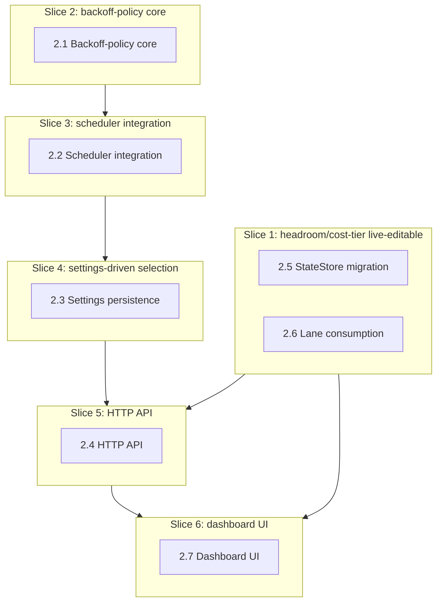

# Vertical Plan — hdl-backoff-policies

Cuts the horizontal layer map into minimum cross-stack increments, each a
working, demo-able, commit-worthy state.

## 1. Slicing Strategy

Two independent feature threads share this epic: backoff-policy
(layers 2.1-2.4) and headroom/cost-tier tunability (layers 2.5-2.6). They
converge only in the dashboard (2.7). Slices follow the backoff-policy
thread's real dependency chain first (core → scheduler → settings → HTTP),
since 2.2's scheduler restructure is the epic's single highest-risk item
and deserves to be proven safe in isolation before anything depends on it;
the headroom/cost-tier thread (Slice 1) is genuinely independent and moldable
to run in parallel per §6. Dashboard work (Slice 6) is last — it needs real
data and real worked numbers from every prior slice to be worth shipping.

## 2. Vertical Slice Plan

### Slice 1 — Headroom/cost-tier become live-editable, independently of backoff policy

**Goal / what works after:** An operator (or a direct API call) can set a
lane's headroom/cost-tier via a new HTTP route, it persists in StateStore,
and `scored-strategy.ts`'s `headroom_floor` gating uses the manual value
over the env-var default — with correct precedence and real input
validation (400 on invalid, never a silently-dropped lane).

**Layers touched:** 2.5 (StateStore migration) + 2.6 (lane consumption)
+ the headroom/cost-tier half of 2.4 (HTTP routes).

**NOT yet included:** backoff-policy work entirely (layers 2.1-2.3, the
other half of 2.4); dashboard UI (2.7 — this slice is API/data-layer only).

**Verified by:** unit tests for `setManualHeadroom`/`getManualHeadroom`/
`setManualCostTier`/`getManualCostTier` (mirroring existing
`manual_override` test coverage); a real `scored-strategy.ts` routing
decision test confirming a manually-set headroom overrides the env-var
default; live curl test of the new route confirming a 400 on an invalid
value with no lane dropped from `GET /lanes`.

**Commit represents:** the smaller of the epic's two features, fully
closed end-to-end (data layer + resolution logic + API), independent of
the riskier scheduler work.

**Dependencies:** none (foundation slice for this thread).

### Slice 2 — Backoff-policy core: pure, exhaustively-tested, zero scheduler coupling

**Goal / what works after:** `createBackoffPolicyRegistry()` returns all 3
policies (`static`, `progressive`, `exponential-progressive`), each a pure
function callable and testable in complete isolation, matching the real
worked wall-clock numbers from design-discussion §3 item 2.

**Layers touched:** 2.1 (backoff-policy core) entirely.

**NOT yet included:** no scheduler wiring yet — these functions exist and
are tested but nothing calls them in the running service yet.

**Verified by:** exhaustive unit tests per policy, including boundary
conditions (progressive at exactly `levelCap`, one tick past it;
exponential at the ceiling, one tick past it) and the specific worked
numbers from the design discussion (exponential reaches 300s at tick 7;
progressive reaches 50s at tick 10).

**Commit represents:** the new pluggable-heuristic surface exists and is
provably correct in isolation, before it touches anything safety-critical.

**Dependencies:** none (foundation slice for this thread).

### Slice 3 — Scheduler integration: the epic's highest-risk slice, proven safe

**Goal / what works after:** `InProcessScheduler` delegates to a
(hardcoded-default, not yet settings-driven) `BackoffPolicy` for ordinary
self-healing errors, while `auth_failed` and known-`resetAt` handling stay
completely unchanged as pre-policy invariants. The reset-on-recovery
guarantee is proven with a dedicated test, not just code review.

**Layers touched:** 2.2 (scheduler integration) entirely, consuming 2.1.

**NOT yet included:** no settings-driven policy selection yet (hardcoded
to `static`, i.e. byte-identical externally-observable behavior to today);
no HTTP/dashboard surface.

**Verified by:** `src/core/scheduler/in-process-scheduler.test.ts`'s
existing 17 tests (the real regression suite for this behavior — corrected
post-collaborative-review from an earlier, wrong reference to
`test/sla-harness`, which drives `LanePipeline.refresh()` directly and
never touches the scheduler at all) re-run confirming byte-identical
behavior with `static` as the (currently hardcoded) policy; a new,
dedicated test simulating suspect→healthy→suspect-again and asserting
`consecutiveSuspectTicks` resets to exactly 0 on recovery; a test
confirming `auth_failed` and known-`resetAt` behavior is completely
unchanged (the pre-policy invariants fire before the pluggable policy is
ever consulted).

**Commit represents:** the highest-risk restructure in the epic, landed
and proven safe while still externally invisible (default policy only) —
the point where "the plumbing works" is verified before "the operator can
change it" (Slice 4) is even possible.

**Dependencies:** Slice 2 (needs the policy registry to delegate to).

### Slice 4 — Settings-driven policy selection, still no HTTP/UI

**Goal / what works after:** The scheduler reads the active policy name +
resolved parameters from the settings table instead of a hardcoded
default — an operator could change behavior by writing directly to the
settings table (not yet via HTTP), and the scheduler picks it up.

**Layers touched:** 2.3 (settings persistence) entirely, wired into 2.2.

**NOT yet included:** no HTTP routes yet (Slice 5); no dashboard (Slice 6).

**Verified by:** a test writing a non-default policy name + parameters
directly to the settings table and confirming the scheduler's next tick
uses it; confirms the per-provider override resolves correctly (a
provider-specific key present → used; absent → falls through to global).

**Commit represents:** the full backoff-policy feature is functionally
complete and real — only its own operator-facing surface (HTTP, UI) is
still missing.

**Dependencies:** Slice 3 (the scheduler must already delegate to a
policy before it can matter which one settings selects).

### Slice 5 — HTTP API for both threads

**Goal / what works after:** `GET`/`POST /backoff-policy` (mirroring
`/routing-strategy`'s real shape) and the headroom/cost-tier live-edit
routes from Slice 1 are both real, live, curl-verified.

**Layers touched:** 2.4 (HTTP API) entirely — the backoff-policy half
(new) and headroom/cost-tier half (already built in Slice 1, this slice
is where it's actually the full picture end-to-end with the policy side
alongside it).

**NOT yet included:** dashboard UI (Slice 6) — this slice is API-only,
curlable but not yet clickable.

**Verified by:** real curl round-trips: GET shows `{active, available}`
for backoff-policy; POST with an invalid name returns the structured
`{error, allowed_policies}` shape; POST with a valid name changes behavior
confirmed via Slice 4's settings-driven wiring.

**Commit represents:** every backend piece of both features is now
real and independently operable via API, before any UI work begins.

**Dependencies:** Slice 4 (backoff-policy HTTP needs settings-driven
selection to already work) and Slice 1 (headroom/cost-tier HTTP already
built there — this slice's diff here may be small/zero if Slice 1 already
covered it in full).

### Slice 6 — Dashboard UI: the operator-facing finish

**Goal / what works after:** A "Probe backoff" Settings section with
named-preset framing (Conservative/Balanced/Aggressive) showing the real
worked wall-clock numbers, a per-provider override control, an "Advanced"
raw-parameter toggle, and per-lane headroom/cost-tier editable fields with
a "manual" badge — everything from every prior slice, now clickable.

**Layers touched:** 2.7 (dashboard UI) entirely.

**NOT yet included:** nothing — this is the last slice.

**Verified by:** real Playwright interaction — pick a preset, confirm it
persists across reload; edit a lane's headroom, confirm the "manual" badge
appears and the value round-trips; confirm the preset copy actually shows
real numbers, not placeholder text.

**Dependencies:** Slice 5 (needs real, working HTTP routes to render
against) and Slice 2 (needs the real worked wall-clock numbers for copy).

## 3. Overlay Diagram

## 4. Deferred Items

- **Automatic headroom inference** (out_of_credit-frequency-based) —
  explicitly deferred per the operator's own scoping; manual tunability
  (this epic) is a real prerequisite for it (there needs to be a settings
  surface to plug an inference result into), so it's a natural next epic,
  not something to build alongside this one.
- **A 4th backoff policy (lookup-table progressive)** — design-discussion
  §6 item 3 flags this as a possible v2 if the simple multiplicative
  formula proves too coarse; the interface (Slice 2) is designed to make
  adding one trivial later, but none is built now.
- **Provider-published live rate-limit display** (Claude/OpenRouter's real
  headers, per research-brief.md) — the dashboard's "known limits" framing
  from the original scoping Artifact is a read-only informational display,
  separate from the tunable policy itself; not included in this epic's
  slices, worth a small follow-up once this ships.

## 5. Risk by Slice

- **Slice 1 — low.** Direct copy of an already-proven pattern
  (`manual_override`), fully independent of the riskier scheduler work.
- **Slice 2 — low.** Pure functions, no I/O, no existing behavior to
  regress — dominant risk is a formula bug, fully caught by exhaustive
  unit tests before anything depends on it.
- **Slice 3 — high.** The epic's one genuinely risky slice — touches
  existing, safety-documented scheduler behavior. Dominant risk is exactly
  what grill caught in planning (silently regressing `resetAt`-aware
  scheduling) recurring as an implementation-time mistake despite the
  design being correct on paper — the dedicated reset-on-recovery test is
  non-negotiable here, not a nice-to-have.
- **Slice 4 — medium.** Mostly plumbing (read settings instead of a
  constant), but the per-provider override's fallback-to-global logic is
  worth real test coverage, not just the happy path.
- **Slice 5 — low.** Mirrors an already-proven route pattern
  (`/routing-strategy`) closely enough that surprises are unlikely.
- **Slice 6 — low.** UI/content work built on already-verified real data
  from every prior slice; dominant risk is copy quality (does the SLA
  tradeoff actually read clearly), not correctness.

## 6. Moldability Notes

- **Slice 1 can run fully in parallel with Slices 2-4** — headroom/
  cost-tier has zero technical dependency on the backoff-policy thread;
  they're sequenced together in this document only because Slice 5/6 need
  both. A team of two could split here with no coordination cost until
  Slice 5.
- **Slices 3 and 4 could merge** if settings-driven selection is simple
  enough to land in the same commit as the scheduler restructure — split
  here so the highest-risk change (Slice 3) can be verified and reviewed
  in complete isolation from anything operator-facing, on its own merits.
- **Slice 5 cannot move earlier than Slice 4** — there's nothing for the
  backoff-policy HTTP routes to expose until settings-driven selection
  exists; the headroom/cost-tier half of Slice 5 could move as early as
  right after Slice 1, though, if a narrower increment is wanted.
- **Slice 6 cannot move earlier** — shipping dashboard copy before Slice
  2's real worked numbers exist would mean placeholder text, exactly what
  grill H2 flagged as a problem in the original (pre-pluggable) scoping.
