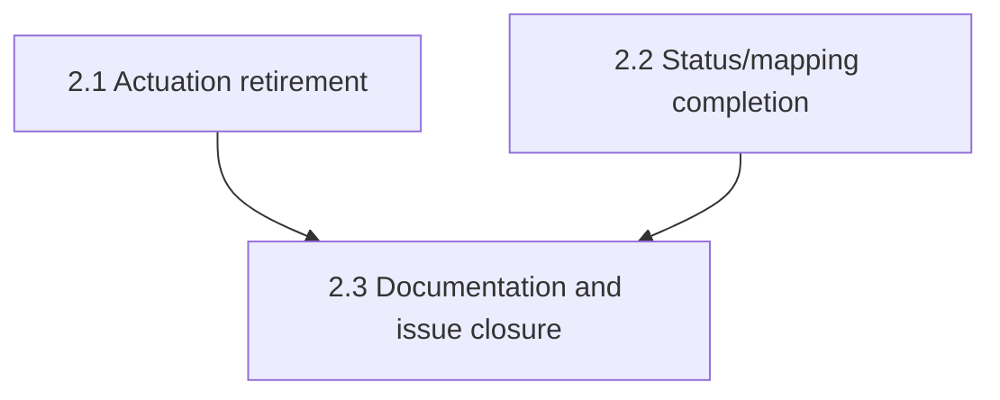

# Horizontal Plan — hdl-multica-status-handoff

Lightweight per design-discussion.md §8 — this epic is mostly deletion of an
already-isolated module plus one additive field, not a new architecture.

## 1. Layer Inventory

1. **Actuation retirement** — delete `src/core/actuation/{multica-rest-
   client,multica-control-adapter,circuit-breaker}.ts` + their tests; simplify
   `main.ts` wiring to always select `StubControlAdapter`; rewrite the two
   `main.test.ts` assertions that reference the deleted behavior (grill H1).
2. **Status/mapping completion** — `getLaneStatuses()` gains
   `multica_agent_ids: string[]` per lane, sourced from the already-built
   `LaneAgentResolver`; `main.ts` threads the resolver through to
   `createHttpServer`.
3. **Documentation & issue closure** — new `docs/decisions/DEC-hdl-multica-
   disable-contract.md`; stale-comment fixes in `lane-agent-resolver.ts` /
   `control-adapter.ts`; `.env.example` cleanup; `docs/vision.md` backlog
   item rewrite; close `heimdall#83` (grill U2).

## 2. Per-Layer Requirements

### 2.1 Actuation retirement

Responsibility: stop Heimdall from ever calling Multica's REST API to
actuate an agent, unconditionally — not behind a flag.

Key files: `src/core/actuation/{multica-rest-client,multica-control-
adapter,circuit-breaker}.ts` + `.test.ts` (delete all six); `src/main.ts`
lines ~102-123 (`buildMulticaActuationStack`, delete) and ~141-206 (per-lane
adapter selection, simplify to unconditional Stub); `src/main.test.ts` lines
~359-420 (rewrite per grill H1).

Must do overall: every lane's `controlAdapters` entry is `StubControlAdapter`
regardless of `MULTICA_BASE_URL`/`WORKSPACE_ID`/PAT being configured in env.
`ControlAdapter` interface, `StubControlAdapter`, the `statusWatcher`
interval, and `ActuationStub` are all kept unchanged — they already correctly
model "no real action taken," confirmed clean by grill's own check (see
grill-record.md Notes).

Dependencies: none upward — pure subtraction plus a wiring simplification
already exercised by every unconfigured deployment today.

### 2.2 Status/mapping completion

Responsibility: expose the one piece of "give back the status" that isn't
already shipped — which Multica agent(s) a lane's status corresponds to.

Key files: `src/api/http-server.ts` (`getLaneStatuses()`, line ~536; the
`GET /lanes` handler, line ~711; `createHttpServer()`'s signature); `src/
main.ts` (thread the already-constructed `resolver` through to
`createHttpServer`, same pattern `rotationControllers` already uses).

Must do overall: `GET /lanes` response gains `multica_agent_ids: string[]`
per lane — `[]`, never omitted, when no mapping is configured. `LaneAgentRe
solver`/`StaticLaneAgentResolver` are kept as-is (`resolve()` already returns
`[]` cleanly for an unmapped lane — verified, not assumed) and repurposed to
this new consumer instead of the deleted one.

Dependencies: none upward — independent of 2.1's deletion, sequenced after
it here only because 2.1 is the higher-priority fix (it closes the actual
bug) and touches the same `main.ts` region, so doing it first avoids
re-touching lines the other slice just edited.

### 2.3 Documentation & issue closure

Responsibility: make the retirement decision and its reasoning survive past
this session, and close the loop on the issue that triggered the epic.

Key files: new `docs/decisions/DEC-hdl-multica-disable-contract.md`;
`src/core/actuation/lane-agent-resolver.ts` and `control-adapter.ts` header
comments (both currently describe themselves solely in terms of feeding the
now-deleted `MulticaControlAdapter`); `.env.example` (remove
`MULTICA_BASE_URL`/`WORKSPACE_ID`/`PAT_TOKEN`, update the
`HEIMDALL_LANE_<N>_MULTICA_AGENT_IDS` comment to describe its new consumer);
`docs/vision.md` backlog item on live actuation verification; the GitHub
issue `heimdall#83` itself (comment + close, per grill U2).

Must do overall: the decision record states the verified Multica constraints
as fact (research-brief.md §3), links the Artifact considered this session,
and points at `pantheon-v2` as where the real lever now belongs — without
prescribing which option Pantheon should build (design-discussion.md §6
item 1, grill U1).

Dependencies: depends on 2.1 and 2.2 being real (can't document a decision
before the code backing it exists) and needs a merged PR/commit SHA to
reference when closing the issue, so it's last.

## 3. Cross-Layer Dependencies

- 2.1 and 2.2 are independent of each other technically; sequenced 2.1 →
  2.2 here purely to avoid two stories touching overlapping `main.ts` lines
  concurrently, and because 2.1 is the actual bug fix.
- 2.3 depends on both — it documents and closes out what 2.1/2.2 shipped.

## 4. Layer Map Diagram

## 5. Scope Summary

Three layers, two of them independent subtraction/addition changes to the
same small set of files, one documentation/closure layer that depends on
both. No new external dependency, no new abstraction. Confirmed via direct
source read (not assumed) that the actuation module is fully isolated and
that `main.test.ts` is the one existing test surface outside the deleted
files' own tests that needs a rewrite, not just a deletion.
