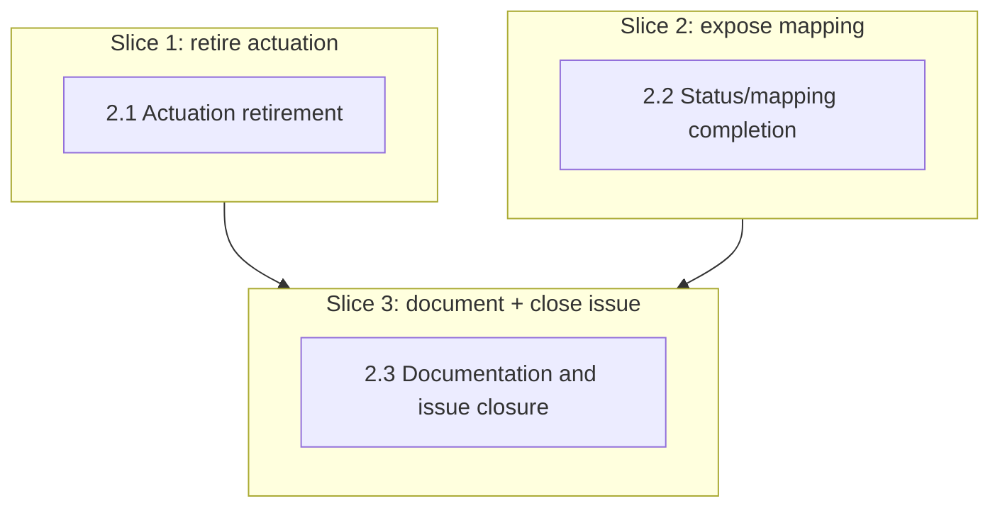

# Vertical Plan — hdl-multica-status-handoff

Lightweight per design-discussion.md §8. Each slice below maps 1:1 to a
horizontal-plan.md layer — with only three layers and no shared file
conflicts beyond the sequencing already noted there, further subdivision
would be pure ceremony.

## Slice 1 — Retire real Multica actuation (closes heimdall#83's code path)

**Goal / what works after:** Every lane's control adapter is
`StubControlAdapter`, unconditionally — confirmed by rewriting the
`main.test.ts` assertions that currently expect the opposite (grill H1).
`npm run build && npm test` green with the three actuation-module files and
their tests deleted.

**Layers touched:** 2.1 entirely.

**NOT yet included:** the `multica_agent_ids` field (Slice 2); the decision
record and issue closure (Slice 3).

**Verified by:** `npm test` (rewritten `main.test.ts` cases green, no
compile errors from the deleted classes anywhere); `ssh dostal@100.75.161.82
/Users/dostal/hive-ci/verify-heimdall.sh <sha>`.

**Commit represents:** the actual bug is gone — Heimdall can no longer
attempt the call that's been 400ing since hda-03 shipped.

**Dependencies:** none.

## Slice 2 — Expose lane→Multica-agent mapping on GET /lanes

**Goal / what works after:** `GET /lanes` returns `multica_agent_ids:
string[]` per lane (empty array, never omitted, for an unmapped lane) —
curl-verified against a real running instance, not just unit-tested.

**Layers touched:** 2.2 entirely.

**NOT yet included:** documentation/closure (Slice 3).

**Verified by:** a `getLaneStatuses()` unit test with a resolver mapping
present vs. absent; live curl of `GET /lanes` post-merge.

**Commit represents:** the "give back the status" half is now actually
complete — everything Pantheon's facade needs to build its own lever is in
the response.

**Dependencies:** none technically; sequenced after Slice 1 to avoid two
stories editing overlapping `main.ts` regions concurrently (horizontal-plan
§3).

## Slice 3 — Document the decision, close the issue

**Goal / what works after:** `DEC-hdl-multica-disable-contract.md` exists
and links the Artifact; stale header comments in `lane-agent-resolver.ts`/
`control-adapter.ts` are fixed; `.env.example` no longer documents dead
Multica-actuation credentials; `docs/vision.md`'s actuation-verification
backlog item reflects the new status-only relationship; `heimdall#83` is
commented on and closed, referencing the decision record and merge commit.

**Layers touched:** 2.3 entirely.

**NOT yet included:** nothing — this is the last slice.

**Verified by:** the decision record exists at the right path and cites
real, verified facts (not restated from memory) from research-brief.md §3;
`gh issue view 83 --json state` shows `CLOSED` after this slice, with a
comment present.

**Commit represents:** the reasoning survives past this session, and the
issue tracker matches what the codebase actually does — no drift left
behind.

**Dependencies:** Slices 1 and 2 (needs real, merged code + a commit/PR to
reference).

## Overlay Diagram

## Risk by Slice

- **Slice 1 — low.** Subtraction of an already-isolated module; the "off"
  path is already proven by every unconfigured deployment today. Dominant
  risk is the `main.test.ts` rewrite (grill H1) — a real, named risk, not a
  hypothetical one.
- **Slice 2 — low.** One additive field on an existing, working endpoint,
  sourced from a resolver whose unmapped-case behavior (`[]`, never throws)
  is already verified.
- **Slice 3 — low.** Documentation and one GitHub API call; no production
  code risk.

## Moldability Notes

Slices 1 and 2 could run in either order or in parallel — they're
independent. Sequenced 1 → 2 here only to avoid concurrent edits to
overlapping `main.ts` lines, and because Slice 1 is the higher-priority fix.
Slice 3 cannot move earlier — it needs both prior slices merged to cite a
real commit/PR when closing the issue.
