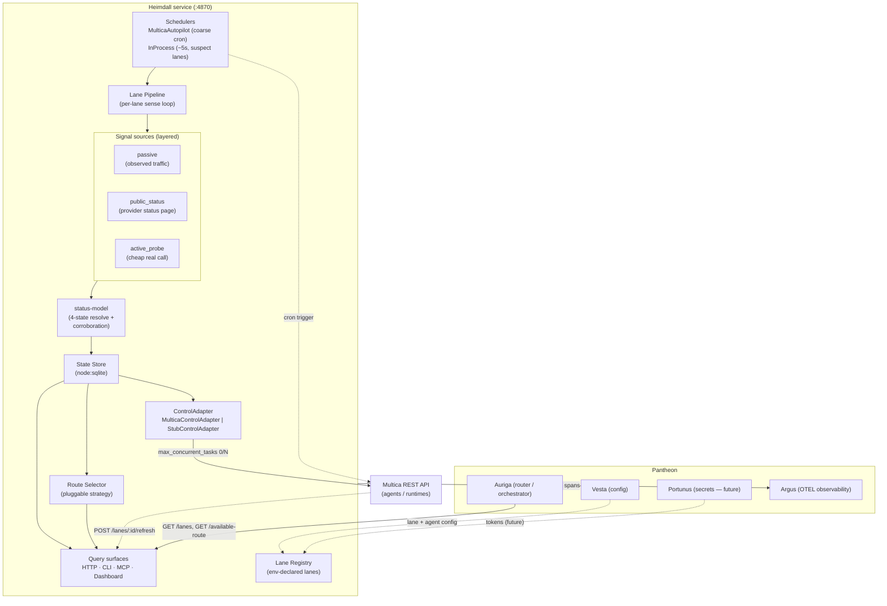

# Heimdall

[](https://github.com/mdostal/heimdall/actions)
[](https://opensource.org/licenses/MIT)
[]()

**The health-aware lane gateway for [Pantheon](https://github.com/mdostal/pantheon-v2).**

Heimdall watches every LLM/runtime *lane* — a `provider × account × runtime`
triple like `claude@mathew.dostal`, `codex`, or `gemini-3-pro` — reports whether
each one is **up, down, out of credit, or degraded**, and actuates on that signal
by disabling or re-enabling a lane's mapped Multica agents.

📖 **[Read the Documentation Site](https://mdostal.github.io/heimdall/)**

## What & why

Agent fleets stall for boring reasons: one account hits its weekly cap while
others sit idle, a runtime silently breaks (the classic codex OAuth hang) and
keeps accepting work it can't finish, or an agent keeps calling a model
generation the provider already deprecated. A `--version` check is not proof a
lane is alive; only a real signal is. Heimdall exists as its own service so
that this sensing-and-actuation loop lives in **one** place with **one**
contract, instead of being re-implemented ad hoc inside every orchestrator,
script, and daemon.

Today Heimdall is the **gateway plus advisory-router half** of that vision: it
*senses* lane health across 6 providers (Claude, Codex, Gemini, Kimi K3,
OpenRouter, Ollama), *actuates* by toggling Multica agent concurrency, keeps
each installation's own live model catalog so agents stop calling deprecated
models, and answers "given this task, which healthy lane should I use?"
through a pluggable, swappable routing strategy. See
[`docs/vision.md`](docs/vision.md) for the full roadmap.

## Architecture



Internally the loop is: **schedulers** tick a lane → the **lane pipeline** gathers
layered **signals** (passive observation, provider status-page piggybacking, sparse
active probes) → **status-model** resolves them into one of four states with a
corroboration guard against provider false-positives → the result is persisted to
the **SQLite state store** → the shared status-watcher calls the lane's
**ControlAdapter** to reconcile Multica agent concurrency. Every tick, status flip,
and actuation attempt emits OTEL to Argus.

For full architectural details, see [`docs/architecture.md`](docs/architecture.md).

## How it fits

Heimdall is one god in **Pantheon**, the [pantheon-v2](https://github.com/mdostal/pantheon-v2)
host. It reads and actuates the orchestration substrate — **Multica**
([firefly-events/multica](https://github.com/firefly-events/multica)) — and
schedules its own health probes as **Multica autopilots** rather than local cron,
honoring the "no box runners" rule. Multica dispatches the SDLC work planned by
**plugin-hive** ([firefly-events.github.io/plugin-hive](https://firefly-events.github.io/plugin-hive/)).
Sibling gods: **Auriga** and **Minerva** (consumers of `GET /available-route` /
`POST /route` per dispatch), **Vesta** (owns lane/agent config in Pantheon),
**Portunus** (will own the long-lived per-lane tokens), and **Argus** (receives
Heimdall's telemetry).

## Quickstart

Requires **Node.js >= 22.5.0** (uses the built-in `node:sqlite` module — the
scripts pass `--experimental-sqlite`).

```bash
npm install
cp .env.example .env        # declare lanes + fill in tokens (never commit .env)
```

`.env` is loaded automatically (`--env-file-if-exists=.env` on `dev`,
`dev:http-only`, `cli`, `mcp` — tolerant of a missing file, so a fresh clone
without `.env` yet still runs, just with zero declared lanes).

Lanes are declared as contiguous `HEIMDALL_LANE_<N>_{ID,PROVIDER,CREDENTIAL_REF}`
triples starting at `1`, with optional `HEIMDALL_LANE_<N>_MODEL` for advisory
routing and `HEIMDALL_LANE_<N>_PRIORITY` to break same-provider ties;
`CREDENTIAL_REF` names another env var holding the actual secret (or, for
Ollama, a base URL). A lane with a missing or empty credential is still
reported by `GET /lanes` — as `down` with an `unconfigured` reason — rather
than crashing the service or silently disappearing. `POST /lanes` (see the
dashboard section below) writes new lanes in this exact shape.

**Never commit `.env`** — it's gitignored; only `.env.example` (with empty
secret values) is tracked. This is the REQ-07 local-secrets stopgap; Portunus
is the planned future fix for secret storage, not yet built.

## Run the real service

```bash
npm run dev            # full composed service on http://localhost:4870
npm run dev:http-only  # HTTP server only, no scheduling (isolated debugging)
```

Runs `src/main.ts` — the full composed service: lane registry + SQLite state
store + Argus OTEL telemetry + a per-lane `MulticaAutopilotScheduler` (coarse
cron, default) and `InProcessScheduler` (fine ~5s, suspect-lane only) + the
HTTP server on `http://localhost:4870` (override with `PORT=<n>`). See
[`docs/decisions/DEC-hdl-scheduler-backend.md`](docs/decisions/DEC-hdl-scheduler-backend.md)
for the scheduler design and the `multica-native-no-box-runners` HARD LAW it
satisfies. Requires `MULTICA_AUTOPILOT_AGENT` to be set (see `.env.example`)
for the Multica backend to register cron triggers; missing it fails that
lane's coarse scheduling clearly without crashing the rest of the service.

`GET /lanes` reads the SQLite state store (override the DB path with
`HEIMDALL_DB_PATH`, default in-memory), reflecting whatever each provider's
signal pipeline (`src/core/lane-pipeline.ts`) last persisted. `POST
/lanes/:laneId/refresh` triggers a real refresh on demand — this is the
endpoint Multica's dispatched agent calls when a lane's autopilot fires.

`GET /available-route?task-type=planning|build|review` returns one usable
advisory route backed by the same lane state. It only chooses lanes with an `up`
status and a resolved credential (a `manual_override: "disabled"` lane is
always excluded, and `"enabled"` always included, regardless of sensed
status), and returns the credential reference handle (`token-ref`) rather than
the secret — plus `model_substituted: true` when the declared model was
deprecated/disabled and the model catalog swapped in a live replacement.
*Which* eligible lane it picks is decided by the active **routing strategy** —
pluggable, not hard-coded (`src/core/routing-strategies/`):

| Strategy | Behavior |
|---|---|
| `priority` (default) | A fixed provider-priority order per task type, overridable per-lane via `HEIMDALL_LANE_<N>_PRIORITY`. |
| `round-robin` | Cycles through eligible lanes, one further per call. |
| `scored` | Weighted candidate scoring against `config/routing-policy.yaml`, deterministic A/B experiment arms, a decision ledger, and generated rationale. Also backs `POST /route` for Auriga/Minerva's existing contract. |
| `off` | Never picks — `GET /available-route` always returns `no_available_route`; the caller uses `GET /lanes` and decides for itself. |

`GET /routing-strategy` / `POST /routing-strategy` (`{"strategy": "priority"\|"round-robin"\|"scored"\|"off"}`)
read/set the active strategy — a global setting, not per-lane. Strategies are
easy to add: implement `RoutingStrategy` (`src/core/routing-strategies/types.ts`)
and register it — the four above are examples, not a ceiling.

## Model catalog — stop calling deprecated models

Each installation fetches its own live model list per configured provider
(`GET`/`POST /models`, `POST /models/refresh`) and stores a local enable/disable
per model — newest generation on by default, older generations available but
off. `GET /available-route` and `POST /route` both substitute automatically
when a declared model is disabled or has vanished from the live catalog, so
agents stop re-learning "Gemini is on 3.x, not 2.0" the expensive way. Never
shipped in git — every operator's catalog reflects their own real provider
access, fetched on demand.

## Query lane status — CLI, HTTP, MCP, and the dashboard

```bash
# HTTP
curl http://localhost:4870/lanes
curl -X POST http://localhost:4870/lanes/<laneId>/refresh   # force a refresh
curl http://localhost:4870/healthz                          # liveness only, no lane data
curl -X POST http://localhost:4870/lanes/<laneId>/override \
  -H "content-type: application/json" -d '{"state":"disabled"}'   # manual override: enabled | disabled | auto
curl -X POST http://localhost:4870/lanes/<laneId>/reset-at \
  -H "content-type: application/json" -d '{"reset_at":"2026-08-13T18:00:00.000Z"}'   # or {"reset_at":null} to clear
curl -X POST http://localhost:4870/lanes \
  -H "content-type: application/json" \
  -d '{"lane_id":"gemini@ops","provider":"gemini","model":"gemini-3-pro","token":"..."}'   # add a lane
curl http://localhost:4870/routing-strategy
curl -X POST http://localhost:4870/routing-strategy \
  -H "content-type: application/json" -d '{"strategy":"round-robin"}'   # priority | round-robin | scored | off
curl -X POST http://localhost:4870/route -H "Content-Type: application/json" \
  -d '{"task_id":"abc","task_type":"build"}'   # always scored — Auriga/Minerva's dispatch contract

# CLI
npm run cli                     # JSON (default)
npm run cli -- --format table   # human-readable table
npm run cli -- route --task-type=build --task-id=abc            # rationale to stdout
npm run cli -- route --task-type=build --task-id=abc --json     # JSON to stderr, lane to stdout

# MCP (stdio server — see src/api/mcp-server.ts for the full tool list)
npm run mcp
```

**Dashboard** — `GET /` (open `http://localhost:4870/` in a browser) serves a
self-contained live lane-status view: no build step, no framework, no
external network calls — it's a pure consumer of Heimdall's own HTTP
endpoints, polled every 5s.

- **Routing strategy** — a settings panel to pick the active strategy.
  Selecting `off` is clearly flagged — it means `/available-route` will stop
  making picks, never a silent neutral state.
- **Model catalog** — grouped by provider, per-model enable/disable toggles,
  and a Refresh button pulling each configured provider's live model list on
  demand.
- **On/off** — per-lane enable/disable/auto controls, backed by
  `POST /lanes/:laneId/override`. The override wins outright over the sensed
  status until cleared back to `auto`, routed through the same
  `ControlAdapter.reconcile()` decision automatic status-driven actuation
  already uses. Always shown as a distinct "manual: …" badge, never silent.
- **Add lane** — a form backed by `POST /lanes`, which writes a new
  `HEIMDALL_LANE_<N>_*` block (+ its secret line) to the local, gitignored
  `.env` (see `src/core/env-file.ts`). Does **not** restart the process —
  the response names the exact command to run (`npm run dev`); the new lane
  is inert until then.
- **Token status** — a "configured" / "token missing" chip per lane
  (`credential_configured`). The raw secret is never sent to the browser
  under any field.
- **Change the times** — an editable reset-at control per lane, backed by
  `POST /lanes/:laneId/reset-at`, preferred by `InProcessScheduler` over the
  sensed `reset_at` when set (scheduling-only — doesn't touch actuation).

**MCP tools** — `npm run mcp` exposes lane, routing-strategy, and model-catalog
operations as MCP tools (an agent, not just a human at the dashboard, can
exercise/test Heimdall). Every tool calls the exact same shared functions the
HTTP routes do — no duplicated validation logic between the two surfaces. A
validation failure (unknown lane, invalid state, a duplicate lane_id, etc.)
returns structured `{ok: false, error, ...}` text content; only a genuinely
unrecognized tool *name* throws a real MCP protocol error.

Other scripts: `npm test` (Node built-in test runner via `tsx`),
`npm run build` (type-check + compile to `dist/`), `npm run sla-report`
(status-correctness SLA harness).

**Actuation** (v2) is enabled per-lane by mapping it to Multica agents via
`HEIMDALL_LANE_<N>_MULTICA_AGENT_IDS` plus `MULTICA_BASE_URL` /
`MULTICA_WORKSPACE_ID` / `MULTICA_PAT_TOKEN`. Mapped lanes get the real
`MulticaControlAdapter`; everything else falls back to a loud `StubControlAdapter`
(log-only, never a silent no-op). See [`.env.example`](.env.example) for every
knob.

## Support & OSS

We welcome contributions and value community involvement!

- Read our [Contributing Guide](CONTRIBUTING.md) to get started.
- See the [Vision & Roadmap](docs/vision.md) to understand where Heimdall is headed.

If Heimdall helps your agent infrastructure, please consider supporting the project:
- ❤️ **[Sponsor on GitHub](https://github.com/sponsors/mdostal)**
- ☕ **[Buy Me A Coffee](https://www.buymeacoffee.com/mdostal)**
