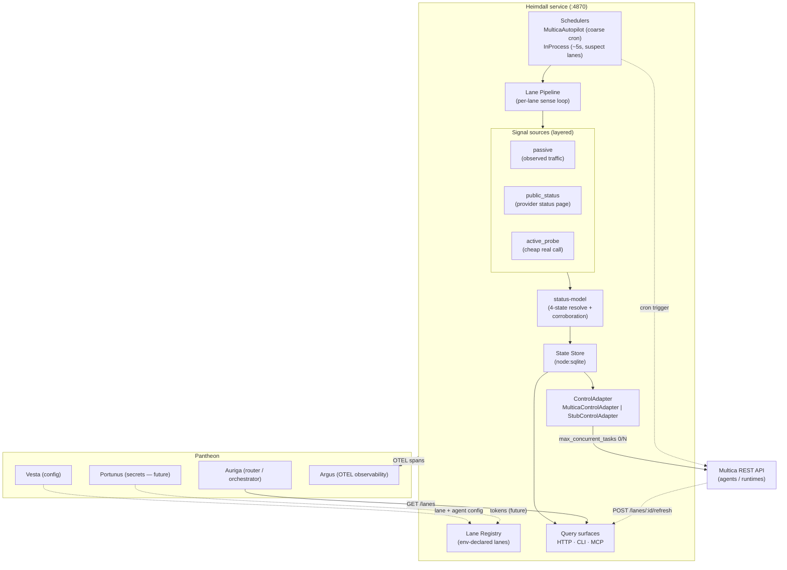

# Heimdall

**The health-aware lane gateway for [Pantheon](https://github.com/mdostal/pantheon-v2).**
Heimdall watches every LLM/runtime *lane* — a `provider × account × runtime`
triple like `claude@mathew.dostal`, `codex`, or `gemini-3-pro` — reports whether
each one is **up, down, out of credit, or degraded**, and actuates on that signal
by disabling or re-enabling a lane's mapped Multica agents.

## What & why

Agent fleets stall for boring reasons: one account hits its weekly cap while
others sit idle, or a runtime silently breaks (the classic codex OAuth hang) and
keeps accepting work it can't finish. A `--version` check is not proof a lane is
alive; only a real signal is. Heimdall exists as its own service so that this
sensing-and-actuation loop lives in **one** place with **one** contract, instead
of being re-implemented ad hoc inside every orchestrator, script, and daemon.

Today Heimdall is the **gateway half** of that vision: it *senses* lane health
from layered signals and *actuates* by toggling Multica agent concurrency. The
routing brain — "given this task, pick the best healthy lane" — is deliberately
out of scope for now and tracked as future work (see [`VISION.md`](VISION.md)).

## Architecture



Internally the loop is: **schedulers** tick a lane → the **lane pipeline** gathers
layered **signals** (passive observation, provider status-page piggybacking, sparse
active probes) → **status-model** resolves them into one of four states with a
corroboration guard against provider false-positives → the result is persisted to
the **SQLite state store** → the shared status-watcher calls the lane's
**ControlAdapter** to reconcile Multica agent concurrency. Every tick, status flip,
and actuation attempt emits OTEL to Argus.

## How it fits

Heimdall is one god in **Pantheon**, the [pantheon-v2](https://github.com/mdostal/pantheon-v2)
host. It reads and actuates the orchestration substrate — **Multica**
([firefly-events/multica](https://github.com/firefly-events/multica)) — and
schedules its own health probes as **Multica autopilots** rather than local cron,
honoring the "no box runners" rule. Multica dispatches the SDLC work planned by
**plugin-hive** ([firefly-events.github.io/plugin-hive](https://firefly-events.github.io/plugin-hive/)).
Sibling gods: **Auriga** (the router that will call `GET /lanes` per dispatch),
**Vesta** (owns lane/agent config in Pantheon), **Portunus** (will own the
long-lived per-lane tokens), and **Argus** (receives Heimdall's telemetry).

## Quickstart

Requires **Node.js >= 22.5.0** (uses the built-in `node:sqlite` module — the
scripts pass `--experimental-sqlite`).

```bash
npm install
cp .env.example .env        # declare lanes + fill in tokens (never commit .env)
```

Lanes are declared as contiguous `HEIMDALL_LANE_<N>_{ID,PROVIDER,CREDENTIAL_REF}`
triples starting at `1`; `CREDENTIAL_REF` names another env var holding the actual
secret. A lane with a missing credential is still reported by `GET /lanes` — as
`down` / `unconfigured` — rather than crashing the service.

```bash
npm run dev            # full composed service on http://localhost:4870
npm run dev:http-only  # HTTP server only, no scheduling (isolated debugging)
```

Query lane status three interchangeable ways — all call the identical
`getLaneStatuses()` core, all synchronous request/response per the
`LaneRouterContract`:

```bash
# HTTP
curl http://localhost:4870/lanes
curl -X POST http://localhost:4870/lanes/<laneId>/refresh   # force a refresh
curl http://localhost:4870/healthz                          # liveness only, no lane data

# CLI
npm run cli                     # JSON (default)
npm run cli -- --format table   # human-readable table

# MCP (stdio server exposing the heimdall.lanes.list tool)
npm run mcp
```

Other scripts: `npm test` (Node built-in test runner via `tsx`),
`npm run build` (type-check + compile to `dist/`), `npm run sla-report`
(status-correctness SLA harness).

**Actuation** (v2) is enabled per-lane by mapping it to Multica agents via
`HEIMDALL_LANE_<N>_MULTICA_AGENT_IDS` plus `MULTICA_BASE_URL` /
`MULTICA_WORKSPACE_ID` / `MULTICA_PAT_TOKEN`. Mapped lanes get the real
`MulticaControlAdapter`; everything else falls back to a loud `StubControlAdapter`
(log-only, never a silent no-op). See [`.env.example`](.env.example) for every
knob.

## Status

**Live / working scaffold (v0.4.0).** Sensing (4-state lane health across layered
signals, SLA-verified) and actuation (Multica agent concurrency toggling via a
circuit-breaker-hardened REST client) both run; actuation is tested against local
mocks only — live end-to-end against the hive Multica is an explicit operator
follow-up, and health-aware *routing* is not built yet. Full trajectory and how to
contribute: **[VISION.md](VISION.md)**.
