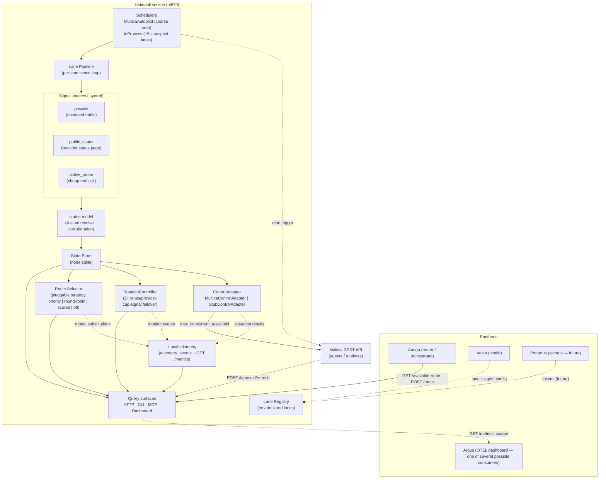

# Heimdall Architecture

Heimdall is the **health-aware lane gateway and router** for Pantheon. It senses lane health from layered signals, routes tasks to the best healthy lane, and actuates by toggling Multica agent concurrency.

## Component & Flow Diagram

## Internal Loop

1. **Schedulers** tick a lane.
2. The **lane pipeline** gathers layered **signals** (passive observation, provider status-page piggybacking, sparse active probes).
3. **status-model** resolves them into one of four states with a corroboration guard against provider false-positives.
4. The result is persisted to the **SQLite state store**.
5. The shared status-watcher calls the lane's **ControlAdapter** to reconcile Multica agent concurrency.
6. On a routing request, the **route selector** picks a healthy, override-aware lane via the active pluggable strategy; the **scored** strategy also records a decision to its ledger and accepts an outcome report back.
7. For providers with 2+ credentialed lanes, **RotationController** detects cap signals and can fail over to the next healthy account.

Every actuation result, rotation event, and model substitution is recorded **locally first** (`telemetry_events`, exposed via `GET /metrics`) — Argus is one optional downstream consumer of the same facts, not the source of truth.

## Metrics, Toggles & A/B Testing
Per the Pantheon OSS standard, Heimdall supports:
- **Toggles:** Every lane can be toggled on/off dynamically (`manual_override`, health-based actuation). The active routing strategy itself is toggleable via `GET`/`POST /routing-strategy`, including an explicit `off` state.
- **A/B Testing:** The `scored` routing strategy assigns deterministic experiment arms from `config/routing-policy.yaml` and records every decision + reported outcome to a local ledger — the actual A/B mechanism, not lane-concurrency weighting.
- **Metrics:** Heimdall keeps its own local record of everything it does (`GET /metrics`, Prometheus text format) — self-contained, independent of any external collector. Argus, Grafana, Prometheus, or anything else OTEL/Prometheus-compatible can scrape it later without Heimdall depending on any of them being present.
