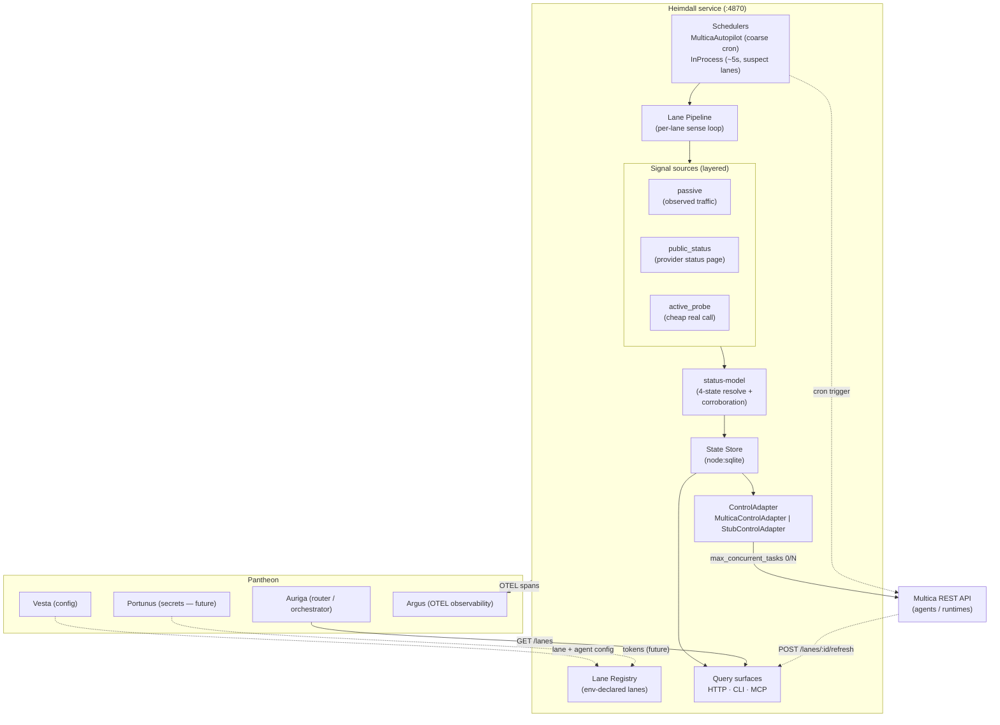

# Heimdall Architecture

Heimdall is the **health-aware lane gateway** for Pantheon. It senses lane health from layered signals and actuates by toggling Multica agent concurrency.

## Component & Flow Diagram

## Internal Loop

1. **Schedulers** tick a lane.
2. The **lane pipeline** gathers layered **signals** (passive observation, provider status-page piggybacking, sparse active probes).
3. **status-model** resolves them into one of four states with a corroboration guard against provider false-positives.
4. The result is persisted to the **SQLite state store**.
5. The shared status-watcher calls the lane's **ControlAdapter** to reconcile Multica agent concurrency. 

Every tick, status flip, and actuation attempt emits OTEL to Argus.

## Metrics, Toggles & A/B Testing
Per the Pantheon OSS standard, Heimdall supports:
- **Toggles:** Every lane can be toggled on/off dynamically (health-based actuation). Feature flags for new signal sources are supported via environment variables.
- **A/B Testing:** Lane routing can be split to perform A/B testing of different LLM providers or models within Pantheon by adjusting lane concurrency weights.
- **Metrics:** All state changes, probe latencies, and actuation events emit OpenTelemetry (OTEL) metrics directly to Argus.
