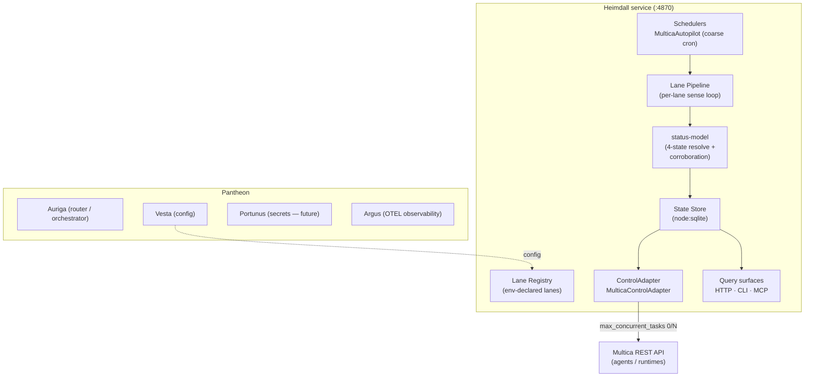

# Heimdall

**The health-aware lane gateway for [Pantheon](https://github.com/mdostal/pantheon-v2).**

Heimdall watches every LLM/runtime *lane* — a `provider × account × runtime` triple — reports whether each one is **up, down, out of credit, or degraded**, and actuates on that signal by disabling or re-enabling a lane's mapped Multica agents.

## What & Why

Agent fleets stall for boring reasons: one account hits its weekly cap while others sit idle, or a runtime silently breaks and keeps accepting work it can't finish. Heimdall exists as its own service so that this sensing-and-actuation loop lives in **one** place with **one** contract.

## Role in Pantheon

Heimdall is one god in **Pantheon**, the host of your agent ecosystem. It reads and actuates the orchestration substrate — **Multica** — and schedules its own health probes as **Multica autopilots**. 

Sibling gods: **Auriga** (router), **Vesta** (config), **Portunus** (secrets), and **Argus** (telemetry).

## Architecture



See the full [Architecture & Internal Flow](architecture.md) for more details.

## Quickstart

Requires **Node.js >= 22.5.0**.

```bash
git clone https://github.com/mdostal/heimdall.git
cd heimdall
npm install
cp .env.example .env        # declare lanes + fill in tokens (never commit .env)
npm run dev                 # full composed service on http://localhost:4870
```

## Support & OSS

Heimdall is open-source (MIT). We welcome contributions!

- **Vision:** [vision.md](vision.md)
- **Contribute:** See [CONTRIBUTING.md](../CONTRIBUTING.md)
- **Support:** Sponsor on [GitHub](https://github.com/sponsors/mdostal) or [Buy Me a Coffee](https://www.buymeacoffee.com/mdostal)
